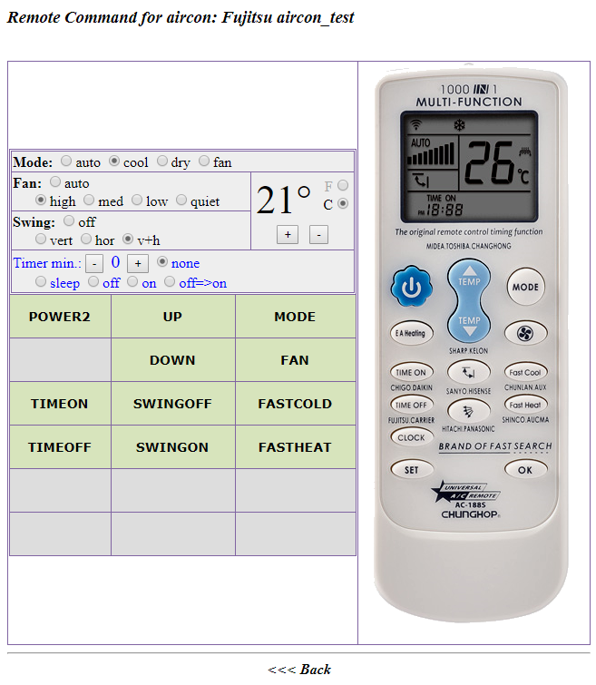

# remotesDB
This is my attempt to define a 'good' database for IRPs and to use with irp_classes (https://github.com/msillano/irp_classes)
It must be a starting point for building home automation applications.
As a demo of remotesDB capabilities, this is an application to perform a simple replica of standard IR remote controls. You can see it as an example of using remotesDB and the included php libraries you can use in your IR applications.

NOTE: For other technical documentation you can see the wiki.

LIMITS
 -  IRP: 1000 CHAR
 -  RAW: 4000 CHAR 
 -  data: 200 CHAR
 -  Raw stream receive precision with Arduino uno Rev.3: +/- 2 microseconds
 -  Raw transmit frequencies with Arduino uno Rev.3: 30KHz - 57 KHz
 -  Raw receive buffer size with Arduino uno Rev.3: 300 samples
 -  Raw transmit size with Arduino uno Rev.3: 300 samples
 
# installation
1) Download and copy everything (all dirs and sub-dirs) in the web area of your WAMP server: e.g. ' ...\apache\htdocs\www\remoteDB'.
2) You must also download irp_classes from https://github.com/msillano/irp_classes and install it in ' ...\apache\htdocs\www\phpIRPlib'
     -    note: Due to links and include, do not change 'remoteDB' and 'phpIRPlib' installation dirs.
3) Create the demo DataBase 'remotesdb' with some data, importing in mySQL the file ...\www\remoteDB\sql\demo_remotesdb.sql
     -    warning: database "remotesdb", application dir "remoteDB": it is not a mistake!
4) This is a demo, so you can not change the default access in ...\www\remoteDB\irp_config.php
5) If you have Arduino-uno and an IR receiver (optional)
     -   See the dir phpIRPlib/Arduino
6) Mandatory with Arduino
     -    Serial communications php-Arduino in windows for phpIRPlib/irp_rxtxArduino.php: download and install 'PHP Serial extension' free from http://www.thebyteworks.com (with some limits).
7) This demo can run without Arduino and  without serial extension, using recorded IR data.
     -    To do it replace in files usr_simplerawRX.php and usr_simpleSerialTX.php the include:
     -    'require_once ("$d/../phpIRPlib/irp_rxtxArduino.php");' with: 'require_once ("$d/irp_rxtxZero.php");'
8) If you have some different IR HW, modify irp_rxtxArduino.php to receive RAW data from your HW.
9) Start from ...\www\remoteDB\index.html

